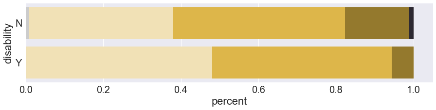
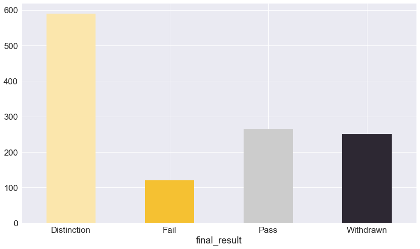

# EDA with final csv file


```python
import pandas as pd
import numpy as np
import matplotlib as mpl
import matplotlib.pyplot as plt
from matplotlib import font_manager, rc
import seaborn as sns
%matplotlib inline
```


```python
pd.set_option('display.max_columns', 500)
np.set_printoptions(threshold=np.inf)
pd.set_option('display.max_rows', 1000)
```


```python
# Read studentinfo file & total csv file
studentinfo = pd.read_csv('studentinfo.csv')
total = pd.read_csv('total.csv', index_col=0)
```

    C:\Users\hyunj\Anaconda3\lib\site-packages\IPython\core\interactiveshell.py:2785: DtypeWarning: Columns (69,76,83,90,97,104,111) have mixed types. Specify dtype option on import or set low_memory=False.
      interactivity=interactivity, compiler=compiler, result=result)


## Demographics data


```python
# Number of students by final_results
demo_df1 = studentinfo.groupby('final_result').count().reset_index().iloc[:,:2]

fig_demo1 = plt.figure(figsize = (9, 6))
plt.grid(linewidth=1)
plt.bar(demo_df1['final_result'],demo_df1['code_module'], color = ['#FBE6AC', '#F5C132', '#CCCCCC', '#2D2833'])
```


    <BarContainer object of 4 artists>


```python
# final_result by imd_band
studentinfo_imd = studentinfo.dropna(subset = ["imd_band"])
studentinfo_imd.shape
```


    (31482, 12)


```python
# final_result by gender
demo_gender=studentinfo.groupby(["gender","final_result"]).size().reindex(level="final_result")
demo_gender=pd.DataFrame(demo_gender)
demo_gender.columns=["Final Result"]
```


```python
sns.set(style="darkgrid")
sns.set(font_scale=1.8)
sns.set_palette("RdYlBu_r")
sns.despine(left=True)

g_graph=demo_gender.unstack().plot(kind='bar',figsize=(14,8),rot=360, color=["#FBE6AC","#F5C132","#CCCCCC","#2D2833"])
g_graph.set(xlabel="Gender",ylabel="Final Result \n")
plt.gca().legend().set_title("")
g_graph.legend(bbox_to_anchor=(0.7,1),loc=1)
genderfig=g_graph.get_figure()
```


    <Figure size 432x288 with 0 Axes>


```python
demo_disability = studentinfo.groupby(["disability", "final_result"]).size()
demo_disability_df = pd.DataFrame(demo_disability["Y"]/demo_disability["Y"].sum())
demo_disability["N"]/demo_disability["N"].sum()
demo_disability_df["1"] = demo_disability["N"]/demo_disability["N"].sum()
demo_disability_df.columns = ['Disabled','Not Disabled']

demo_disability_df = demo_disability_df*100

demo_disability_df_transpose = demo_disability_df.transpose()

demo_disability_df_transpose
```


<div>
<style scoped>
    .dataframe tbody tr th:only-of-type {
        vertical-align: middle;
    }

    .dataframe tbody tr th {
        vertical-align: top;
    }

    .dataframe thead th {
        text-align: right;
    }
</style>
<table border="1" class="dataframe">
  <thead>
    <tr style="text-align: right;">
      <th>final_result</th>
      <th>Distinction</th>
      <th>Fail</th>
      <th>Pass</th>
      <th>Withdrawn</th>
    </tr>
  </thead>
  <tbody>
    <tr>
      <th>Disabled</th>
      <td>7.048040</td>
      <td>22.503161</td>
      <td>31.099874</td>
      <td>39.348925</td>
    </tr>
    <tr>
      <th>Not Disabled</th>
      <td>9.517823</td>
      <td>21.543376</td>
      <td>38.659146</td>
      <td>30.279656</td>
    </tr>
  </tbody>
</table>
</div>


```python
from matplotlib import rcParams
sns.set(style="darkgrid")
sns.set_palette("muted")
rcParams['figure.figsize'] = 11.7,8.27
sns.set(font_scale=1.6)
dis = demo_disability_df_transpose.plot.bar(rot=360,color=["#FBE6AC","#F5C132","#CCCCCC","#2D2833"])
dis.set(xlabel="\n Whether Disabled or Not", ylabel="Percent \n")
dis.legend(bbox_to_anchor=(0.4,1),loc=2)
disfig=dis.get_figure()
```


```python
demo_imd = studentinfo_imd.groupby(["imd_band", "final_result"]).size()

demo_imd_df = pd.DataFrame(demo_imd["0-10%"]+demo_imd["10-20"]+demo_imd["20-30%"])
demo_imd_df["30-70%"]=pd.DataFrame(demo_imd["30-40%"]+demo_imd["40-50%"]+demo_imd["50-60%"]+demo_imd["60-70%"])
demo_imd_df["70-100%"]=pd.DataFrame(demo_imd["70-80%"]+demo_imd["80-90%"]+demo_imd["90-100%"])
demo_imd_df.columns=["0-30%","30-70%", "70-100%"]
```


```python
demo_imd_df_t = demo_imd_df.transpose()
```


```python
demo_imd_df_t = demo_imd_df_t.reindex(["70-100%","30-70%","0-30%"])
demo_imd_df_t
```


<div>
<style scoped>
    .dataframe tbody tr th:only-of-type {
        vertical-align: middle;
    }

    .dataframe tbody tr th {
        vertical-align: top;
    }

    .dataframe thead th {
        text-align: right;
    }
</style>
<table border="1" class="dataframe">
  <thead>
    <tr style="text-align: right;">
      <th>final_result</th>
      <th>Distinction</th>
      <th>Fail</th>
      <th>Pass</th>
      <th>Withdrawn</th>
    </tr>
  </thead>
  <tbody>
    <tr>
      <th>70-100%</th>
      <td>999</td>
      <td>1515</td>
      <td>3436</td>
      <td>2227</td>
    </tr>
    <tr>
      <th>30-70%</th>
      <td>1204</td>
      <td>2720</td>
      <td>5005</td>
      <td>3895</td>
    </tr>
    <tr>
      <th>0-30%</th>
      <td>622</td>
      <td>2672</td>
      <td>3389</td>
      <td>3798</td>
    </tr>
  </tbody>
</table>
</div>


```python
imd_percent = pd.DataFrame(demo_imd_df["0-30%"]/demo_imd_df["0-30%"].sum())
```


```python
imd_percent["30-70%"]=demo_imd_df["30-70%"]/demo_imd_df["30-70%"].sum()
imd_percent["70-100%"]=demo_imd_df["70-100%"]/demo_imd_df["70-100%"].sum()
imd_percent
```


<div>
<style scoped>
    .dataframe tbody tr th:only-of-type {
        vertical-align: middle;
    }

    .dataframe tbody tr th {
        vertical-align: top;
    }

    .dataframe thead th {
        text-align: right;
    }
</style>
<table border="1" class="dataframe">
  <thead>
    <tr style="text-align: right;">
      <th></th>
      <th>0-30%</th>
      <th>30-70%</th>
      <th>70-100%</th>
    </tr>
    <tr>
      <th>final_result</th>
      <th></th>
      <th></th>
      <th></th>
    </tr>
  </thead>
  <tbody>
    <tr>
      <th>Distinction</th>
      <td>0.059345</td>
      <td>0.093886</td>
      <td>0.122172</td>
    </tr>
    <tr>
      <th>Fail</th>
      <td>0.254938</td>
      <td>0.212102</td>
      <td>0.185276</td>
    </tr>
    <tr>
      <th>Pass</th>
      <td>0.323347</td>
      <td>0.390284</td>
      <td>0.420203</td>
    </tr>
    <tr>
      <th>Withdrawn</th>
      <td>0.362370</td>
      <td>0.303727</td>
      <td>0.272349</td>
    </tr>
  </tbody>
</table>
</div>


```python
imdp_transpose=imd_percent.transpose()
imdp_transpose=imdp_transpose*100
```


```python
sns.set(style="darkgrid")
sns.set_palette("pastel")
sns.set(font_scale=1.7)
imdplot=imdp_transpose.plot(kind='barh', stacked=True, rot=360, color=["#FBE6AC","#F5C132","#CCCCCC","#2D2833"])
imdplot.set(xlabel="\n Percent", ylabel="IMD Band")
plt.gca().legend().set_visible(False)
imdfig = imdplot.get_figure()
# imdfig.savefig("IMD Band.png", transparent=True)
```


```python
# Education Level
demo_edu=studentinfo.groupby(["highest_education", "final_result"]).size()
demo_edu_df=pd.DataFrame(demo_edu["Post Graduate Qualification"]/demo_edu["Post Graduate Qualification"].sum())*100

demo_edu_df["HE Qual"]=pd.DataFrame(100*demo_edu["HE Qualification"]/demo_edu["HE Qualification"].sum())
demo_edu_df["A level"]=pd.DataFrame(100*demo_edu["A Level or Equivalent"]/demo_edu["A Level or Equivalent"].sum())
demo_edu_df["Lower than A"]=pd.DataFrame(100*demo_edu["Lower Than A Level"]/demo_edu["Lower Than A Level"].sum())
demo_edu_df["No Qual"]=pd.DataFrame(100*demo_edu["No Formal quals"]/demo_edu["No Formal quals"].sum())

demo_edu_df.columns=['Post Graduate','HE Qual',"A level", "Lower than A", "No Qual"]

demo_edu_t=demo_edu_df.transpose()
demo_edu_t
```


<div>
<style scoped>
    .dataframe tbody tr th:only-of-type {
        vertical-align: middle;
    }

    .dataframe tbody tr th {
        vertical-align: top;
    }

    .dataframe thead th {
        text-align: right;
    }
</style>
<table border="1" class="dataframe">
  <thead>
    <tr style="text-align: right;">
      <th>final_result</th>
      <th>Distinction</th>
      <th>Fail</th>
      <th>Pass</th>
      <th>Withdrawn</th>
    </tr>
  </thead>
  <tbody>
    <tr>
      <th>Post Graduate</th>
      <td>28.115016</td>
      <td>10.862620</td>
      <td>37.380192</td>
      <td>23.642173</td>
    </tr>
    <tr>
      <th>HE Qual</th>
      <td>14.735729</td>
      <td>16.701903</td>
      <td>41.437632</td>
      <td>27.124736</td>
    </tr>
    <tr>
      <th>A level</th>
      <td>10.651477</td>
      <td>19.273763</td>
      <td>41.381274</td>
      <td>28.693485</td>
    </tr>
    <tr>
      <th>Lower than A</th>
      <td>5.525156</td>
      <td>26.037392</td>
      <td>33.325733</td>
      <td>35.111719</td>
    </tr>
    <tr>
      <th>No Qual</th>
      <td>4.610951</td>
      <td>27.377522</td>
      <td>25.072046</td>
      <td>42.939481</td>
    </tr>
  </tbody>
</table>
</div>


```python
demo_edu_t = demo_edu_t.reindex(["Post Graduate","HE Qual","A level", "Lower than A", "No Qual"])
```


```python
sns.set(style="darkgrid")
sns.set(font_scale=2.2)
sns.set_palette("YlGnBu_r")
plt.rcParams["figure.figsize"]=(14,8)

fig = demo_edu_t.plot(kind='barh',stacked=True, rot=360, color=["#FBE6AC","#F5C132","#CCCCCC","#2D2833"])
# fig = demo_edu_t.plot.barh(rot=360, stacked=True, width=0.9, color='#3b5998',figsize=(20,15))
fig.set(xlabel="Percent", ylabel="Education Level")
plt.gca().legend().set_visible(False)
plt.legend(bbox_to_anchor=(1.31,1),loc=1)
edufig = fig.get_figure()

# edufig.savefig("edulevel.png", transparent=True)
```


```python
# age
demo_age = studentinfo.groupby(["age_band", "final_result"]).size()
demo_age_df = pd.DataFrame(100*demo_age["55<="]/demo_age["55<="].sum())
demo_age_df["35-55"]=pd.DataFrame(100*demo_age["35-55"]/demo_age["35-55"].sum())
demo_age_df["0-35"]=pd.DataFrame(100*demo_age["0-35"]/demo_age["0-35"].sum())
demo_age_df.columns=["55-","35-55","0-35"]
demo_age_df
```


<div>
<style scoped>
    .dataframe tbody tr th:only-of-type {
        vertical-align: middle;
    }

    .dataframe tbody tr th {
        vertical-align: top;
    }

    .dataframe thead th {
        text-align: right;
    }
</style>
<table border="1" class="dataframe">
  <thead>
    <tr style="text-align: right;">
      <th></th>
      <th>55-</th>
      <th>35-55</th>
      <th>0-35</th>
    </tr>
    <tr>
      <th>final_result</th>
      <th></th>
      <th></th>
      <th></th>
    </tr>
  </thead>
  <tbody>
    <tr>
      <th>Distinction</th>
      <td>18.981481</td>
      <td>11.873211</td>
      <td>8.119770</td>
    </tr>
    <tr>
      <th>Fail</th>
      <td>13.425926</td>
      <td>18.997138</td>
      <td>22.798989</td>
    </tr>
    <tr>
      <th>Pass</th>
      <td>42.592593</td>
      <td>40.284109</td>
      <td>36.911611</td>
    </tr>
    <tr>
      <th>Withdrawn</th>
      <td>25.000000</td>
      <td>28.845542</td>
      <td>32.169630</td>
    </tr>
  </tbody>
</table>
</div>


```python
demo_age_df_t = demo_age_df.transpose()
```


```python
sns.set(style="darkgrid")
#sns.set_palette("pastel")
sns.set(font_scale=1.8)
ageplot=demo_age_df_t.plot(kind='barh', stacked=True, rot=360, color=["#FBE6AC","#F5C132","#CCCCCC","#2D2833"])
plt.xlabel("Percent")
plt.ylabel("Age        ", rotation=360)
# ageplot.set(xlabel="\n Percent", ylabel="Age \n")
plt.gca().legend().set_visible(False)
agefig = ageplot.get_figure()
# agefig.savefig("Age.png", transparent=True)
```


_______________

# Education Level Analysis

## Color Order : No Qual - Lower than A - A Level - HE Qual - Postgraduate

### Education Level(color) and Age


```python
tmp = (total.groupby('age_band')['highest_education'].value_counts() / total.groupby('age_band')['highest_education'].count()).to_frame()
tmp = tmp.unstack()
tmp = tmp.fillna(0)
```


```python
tmp['c1'] = tmp['highest_education']['No Formal quals']
tmp['c2'] = tmp['c1'] + tmp['highest_education']['Lower Than A Level']
tmp['c3'] = tmp['c2'] + tmp['highest_education']['A Level or Equivalent']
tmp['c4'] = tmp['c3'] + tmp['highest_education']['HE Qualification']
tmp['c5'] = tmp['c4'] + tmp['highest_education']['Post Graduate Qualification']

fig = plt.figure(figsize = (15, 5))
sns.set_style('darkgrid')
sns.set(font_scale =2)

bar5 = sns.barplot(y=tmp.index, x=tmp['c5'], color='#2D2833')
bar4 = sns.barplot(y=tmp.index, x=tmp['c4'], color='#A5811C')
bar3 = sns.barplot(y=tmp.index, x=tmp['c3'], color='#F5C132')
bar2 = sns.barplot(y=tmp.index, x=tmp['c2'], color='#FBE6AC')
bar1 = sns.barplot(y=tmp.index, x=tmp['c1'], color='#CCCCCC')
bar1.set_xlabel('percent')

# fig.savefig('ageband.png', transparent = True)
```


    Text(0.5,0,'percent')


### Education Level(color) and Disability(Y,N)


```python
tmp3 = (total.groupby('disability')['highest_education'].value_counts() / total.groupby('disability')['highest_education'].count()).to_frame()
tmp3 = tmp3.unstack().fillna(0)

tmp3['c1'] = tmp3['highest_education']['No Formal quals']
tmp3['c2'] = tmp3['c1'] + tmp3['highest_education']['Lower Than A Level']
tmp3['c3'] = tmp3['c2'] + tmp3['highest_education']['A Level or Equivalent']
tmp3['c4'] = tmp3['c3'] + tmp3['highest_education']['HE Qualification']
tmp3['c5'] = tmp3['c4'] + tmp3['highest_education']['Post Graduate Qualification']

fig = plt.figure(figsize = (15, 3))
sns.set_style('darkgrid')
sns.set(font_scale =2)

bar5 = sns.barplot(y=tmp3.index, x=tmp3['c5'], color='#2D2833')
bar4 = sns.barplot(y=tmp3.index, x=tmp3['c4'], color='#A5811C')
bar3 = sns.barplot(y=tmp3.index, x=tmp3['c3'], color='#F5C132')
bar2 = sns.barplot(y=tmp3.index, x=tmp3['c2'], color='#FBE6AC')
bar1 = sns.barplot(y=tmp3.index, x=tmp3['c1'], color='#CCCCCC')
bar1.set_xlabel('percent')
fig.savefig('disability.png', transparent = True)
```





### Education level(color) and imd_band


```python
tmp2 = (total.groupby('imd_band')['highest_education'].value_counts() / total.groupby('imd_band')['highest_education'].count()).to_frame()
tmp2 = tmp2.unstack().fillna(0)

tmp2['c1'] = tmp2['highest_education']['No Formal quals']
tmp2['c2'] = tmp2['c1'] + tmp2['highest_education']['Lower Than A Level']
tmp2['c3'] = tmp2['c2'] + tmp2['highest_education']['A Level or Equivalent']
tmp2['c4'] = tmp2['c3'] + tmp2['highest_education']['HE Qualification']
tmp2['c5'] = tmp2['c4'] + tmp2['highest_education']['Post Graduate Qualification']

fig = plt.figure(figsize = (15, 5))
sns.set_style('darkgrid')
sns.set(font_scale =2)

bar5 = sns.barplot(y=tmp2.index, x=tmp2['c5'], color='#2D2833')
bar4 = sns.barplot(y=tmp2.index, x=tmp2['c4'], color='#A5811C')
bar3 = sns.barplot(y=tmp2.index, x=tmp2['c3'], color='#F5C132')
bar2 = sns.barplot(y=tmp2.index, x=tmp2['c2'], color='#FBE6AC')
bar1 = sns.barplot(y=tmp2.index, x=tmp2['c1'], color='#CCCCCC')
bar1.set_xlabel('percent')

# fig.savefig('imdband.png', transparent = True)
```


    Text(0.5,0,'percent')


-----------

# Behavior Data

## Example with the split(half) period


```python
total_half = pd.read_csv('total_half.csv', index_col=0)
```


```python
# click_mean
click_mean = total_half.groupby('final_result')['click_mean'].mean().to_frame().transpose()
click_mean = click_mean[['Distinction', 'Pass', 'Fail', 'Withdrawn']]
```


```python
fig = plt.figure(figsize = (11, 6))
sns.set_style(style='darkgrid')
sns.set(font_scale=1.7)
col = "click_mean"
bar = sns.barplot(data=click_mean, palette=["#FBE6AC","#CCCCCC","#F5C132","#2D2833"])
bar.set_ylabel(col)
# fig.savefig('preview.png', transparent = True)
```


    Text(0,0.5,'click_mean')


```python
# click_std
click_std = total_half.groupby('final_result')['click_mean'].mean().to_frame().transpose()
click_std = click_std[['Distinction', 'Pass', 'Fail', 'Withdrawn']]
```


```python
fig = plt.figure(figsize = (11, 6))
sns.set_style(style='darkgrid')
sns.set(font_scale=1.7)
col = "click_std"
bar = sns.barplot(data=click_std, palette=["#FBE6AC","#CCCCCC","#F5C132","#2D2833"])
bar.set_ylabel(col)
# fig.savefig('preview.png', transparent = True)
```


    Text(0,0.5,'click_std')


```python
# click_preview
preview = total_half.groupby('final_result')['preview'].mean().to_frame().transpose()
preview = preview[['Distinction', 'Pass', 'Fail', 'Withdrawn']]
```


```python
fig = plt.figure(figsize = (11, 6))
sns.set_style(style='darkgrid')
sns.set(font_scale=1.7)
col = "preview"
bar = sns.barplot(data=preview, palette=["#FBE6AC","#CCCCCC","#F5C132","#2D2833"])
bar.set_ylabel(col)
# fig.savefig('preview.png', transparent = True)
```


    Text(0,0.5,'preview')


## Submission Data

### Submit_early


```python
# How early did students submit their assignments?
# Example with code_module = AAA & code_presentation = 2013J
AAA_2013J = total[(total['code_module'] == 'AAA')& (total['code_presentation'] == '2013J')]

AAA_2013J_date_submitted = AAA_2013J[['date_submitted1', 'date_submitted2', 'date_submitted3','date_submitted4','date_submitted5', 'date_submitted6', 'date_submitted7', 'date_submitted8', 'date_submitted9', 'date_submitted10', 'date_submitted11', 'date_submitted12', 'date_submitted13', 'date_submitted14']].groupby(AAA_2013J['id_student']).min()
AAA_2013J_date = AAA_2013J[['date1', 'date2', 'date3', 'date4', 'date5', 'date6', 'date7', 'date8', 'date9', 'date10', 'date11', 'date12', 'date13', 'date14']].groupby(AAA_2013J['id_student']).min()


AAA_2013J_date_submitted.columns = [1,2,3,4,5,6,7,8,9,10,11,12,13,14]
AAA_2013J_date.columns =  [1,2,3,4,5,6,7,8,9,10,11,12,13,14]


AAA_2013J_date_delayed = AAA_2013J_date - AAA_2013J_date_submitted
AAA_2013J_date_delayed.reset_index(inplace=True)


AAA_2013J =AAA_2013J.reset_index()


AAA_2013J_date_delayed['result'] = AAA_2013J['final_result']

AAA_2013J_date_delayed['std'] = np.std(AAA_2013J_date_delayed[[1,2,3,4,5,6,7,8,9,10,11,12,13,14]], axis=1)
AAA_2013J_date_delayed['mean'] = np.mean(AAA_2013J_date_delayed[[1,2,3,4,5,6,7,8,9,10,11,12,13,14]], axis=1)

AAA_2013J_date_delayed['mean'].groupby(AAA_2013J_date_delayed['result']).mean().plot(figsize=(14,8), kind = 'bar', rot = 360, color = ['#FBE6AC', '#F5C132', '#CCCCCC', '#2D2833'], legend = False)
```


    <matplotlib.axes._subplots.AxesSubplot at 0x1609fe8bb38>


### Sum_click


```python
# How much did students click their class materials?
# Example with code_module = AAA & code_presentation = 2013J
AAA_2013J_EDA = total[(total['code_module'] == 'AAA') & (total['code_presentation'] == '2013J')]
AAA_2013J_sum_click = AAA_2013J_EDA[['id_student', 'sum_click_sum0', 'sum_click_sum1', 'sum_click_sum2', 'sum_click_sum3', 'sum_click_sum4', 'sum_click_sum5', 'sum_click_sum6', 'sum_click_sum7', 'sum_click_sum8', 'sum_click_sum9', 'sum_click_sum10', 'sum_click_sum11', 'sum_click_sum12', 'sum_click_sum13', 'sum_click_sum14', 'final_result']]

AAA_2013J_sum_click.columns = ['id_student', 0,1,2,3,4,5,6,7,8,9,10,11,12,13,14, 'final_result']

AAA_2013J_sum_click['mean'] = np.mean(AAA_2013J_sum_click[[0,1,2,3,4,5,6,7,8,9,10,11,12,13,14]], axis = 1)
AAA_2013J_sum_click['std'] = np.std(AAA_2013J_sum_click[[1,2,3,4,5,6,7,8,9,10,11,12,13,14]], axis=1)

AAA_2013J_sum_click['mean'].groupby(AAA_2013J_sum_click['final_result']).mean().plot(figsize=(14,8), kind = 'bar', rot = 360, color = ['#FBE6AC', '#F5C132', '#CCCCCC','#2D2833'], legend = False)
```

    C:\Users\hyunj\Anaconda3\lib\site-packages\ipykernel_launcher.py:8: SettingWithCopyWarning: 
    A value is trying to be set on a copy of a slice from a DataFrame.
    Try using .loc[row_indexer,col_indexer] = value instead
    
    See the caveats in the documentation: http://pandas.pydata.org/pandas-docs/stable/indexing.html#indexing-view-versus-copy
      
    C:\Users\hyunj\Anaconda3\lib\site-packages\ipykernel_launcher.py:9: SettingWithCopyWarning: 
    A value is trying to be set on a copy of a slice from a DataFrame.
    Try using .loc[row_indexer,col_indexer] = value instead
    
    See the caveats in the documentation: http://pandas.pydata.org/pandas-docs/stable/indexing.html#indexing-view-versus-copy
      if __name__ == '__main__':


    <matplotlib.axes._subplots.AxesSubplot at 0x1609fe9eda0>





## Withdrawal Data


```python
credit = total['studied_credits'].value_counts().sort_index().to_frame()
credit['bin'] = credit.index.map(lambda x : int(x / 30) * 30)
credit = credit.groupby('bin')['studied_credits'].sum().to_frame()
```


```python
credit_wd = total[total['final_result'] == 'Withdrawn']['studied_credits'].value_counts().sort_index().to_frame()
credit_wd['bin'] = credit_wd.index.map(lambda x : int(x / 30) * 30)
credit_wd = credit_wd.groupby('bin')['studied_credits'].sum().to_frame()
```


```python
credit_merge = credit.merge(credit_wd, how = 'inner', on = 'bin')
credit_merge.reset_index(inplace=True, drop=False)
```


```python
credit_merge['percent'] = credit_merge['studied_credits_y'] / credit_merge['studied_credits_x']
```


```python
fig = plt.figure(figsize = (15, 8))
sns.set_style(style='darkgrid')
sns.set(font_scale=2)
col = "percent"
row = "credits"
bar = sns.barplot(data=credit_merge, y='percent', x='bin', palette=["#FBE6AC","#CCCCCC","#F5C132","#2D2833"])
bar.set_ylabel(col)
bar.set_xlabel(row)
sns.set(font_scale=1.6)
for index, row in credit_merge.iterrows():
    bar.text(row.name, row.percent, int(row.studied_credits_x), va='bottom', ha='center', color='darkgrey')
    
# fig.savefig('credit.png', transparent = True)
```


```python
withdrawn = total[total['final_result'] == 'Withdrawn']
withdrawn.head()
```


<div>
<style scoped>
    .dataframe tbody tr th:only-of-type {
        vertical-align: middle;
    }

    .dataframe tbody tr th {
        vertical-align: top;
    }

    .dataframe thead th {
        text-align: right;
    }
</style>
<table border="1" class="dataframe">
  <thead>
    <tr style="text-align: right;">
      <th></th>
      <th>code_module</th>
      <th>code_presentation</th>
      <th>id_student</th>
      <th>gender</th>
      <th>region</th>
      <th>highest_education</th>
      <th>imd_band</th>
      <th>age_band</th>
      <th>num_of_prev_attempts</th>
      <th>studied_credits</th>
      <th>disability</th>
      <th>final_result</th>
      <th>date_registration</th>
      <th>date_unregistration</th>
      <th>date1</th>
      <th>id_assessment1</th>
      <th>date_submitted1</th>
      <th>is_banked1</th>
      <th>score1</th>
      <th>assessment_type1</th>
      <th>weight1</th>
      <th>date2</th>
      <th>id_assessment2</th>
      <th>date_submitted2</th>
      <th>is_banked2</th>
      <th>score2</th>
      <th>assessment_type2</th>
      <th>weight2</th>
      <th>date3</th>
      <th>id_assessment3</th>
      <th>date_submitted3</th>
      <th>is_banked3</th>
      <th>score3</th>
      <th>assessment_type3</th>
      <th>weight3</th>
      <th>date4</th>
      <th>id_assessment4</th>
      <th>date_submitted4</th>
      <th>is_banked4</th>
      <th>score4</th>
      <th>assessment_type4</th>
      <th>weight4</th>
      <th>date5</th>
      <th>id_assessment5</th>
      <th>date_submitted5</th>
      <th>is_banked5</th>
      <th>score5</th>
      <th>assessment_type5</th>
      <th>weight5</th>
      <th>date6</th>
      <th>id_assessment6</th>
      <th>date_submitted6</th>
      <th>is_banked6</th>
      <th>score6</th>
      <th>assessment_type6</th>
      <th>weight6</th>
      <th>date7</th>
      <th>id_assessment7</th>
      <th>date_submitted7</th>
      <th>is_banked7</th>
      <th>score7</th>
      <th>assessment_type7</th>
      <th>weight7</th>
      <th>date8</th>
      <th>id_assessment8</th>
      <th>date_submitted8</th>
      <th>is_banked8</th>
      <th>score8</th>
      <th>assessment_type8</th>
      <th>weight8</th>
      <th>date9</th>
      <th>id_assessment9</th>
      <th>date_submitted9</th>
      <th>is_banked9</th>
      <th>score9</th>
      <th>assessment_type9</th>
      <th>weight9</th>
      <th>date10</th>
      <th>id_assessment10</th>
      <th>date_submitted10</th>
      <th>is_banked10</th>
      <th>score10</th>
      <th>assessment_type10</th>
      <th>weight10</th>
      <th>date11</th>
      <th>id_assessment11</th>
      <th>date_submitted11</th>
      <th>is_banked11</th>
      <th>score11</th>
      <th>assessment_type11</th>
      <th>weight11</th>
      <th>date12</th>
      <th>id_assessment12</th>
      <th>date_submitted12</th>
      <th>is_banked12</th>
      <th>score12</th>
      <th>assessment_type12</th>
      <th>weight12</th>
      <th>date13</th>
      <th>id_assessment13</th>
      <th>date_submitted13</th>
      <th>is_banked13</th>
      <th>score13</th>
      <th>assessment_type13</th>
      <th>weight13</th>
      <th>date14</th>
      <th>id_assessment14</th>
      <th>date_submitted14</th>
      <th>is_banked14</th>
      <th>score14</th>
      <th>assessment_type14</th>
      <th>weight14</th>
      <th>sum_click_sum0</th>
      <th>sum_click_sum1</th>
      <th>sum_click_sum2</th>
      <th>sum_click_sum3</th>
      <th>sum_click_sum4</th>
      <th>sum_click_sum5</th>
      <th>sum_click_sum6</th>
      <th>sum_click_sum7</th>
      <th>sum_click_sum8</th>
      <th>sum_click_sum9</th>
      <th>sum_click_sum10</th>
      <th>sum_click_sum11</th>
      <th>sum_click_sum12</th>
      <th>sum_click_sum13</th>
      <th>sum_click_sum14</th>
      <th>sum_click_mean0</th>
      <th>sum_click_mean1</th>
      <th>sum_click_mean2</th>
      <th>sum_click_mean3</th>
      <th>sum_click_mean4</th>
      <th>sum_click_mean5</th>
      <th>sum_click_mean6</th>
      <th>sum_click_mean7</th>
      <th>sum_click_mean8</th>
      <th>sum_click_mean9</th>
      <th>sum_click_mean10</th>
      <th>sum_click_mean11</th>
      <th>sum_click_mean12</th>
      <th>sum_click_mean13</th>
      <th>sum_click_mean14</th>
      <th>sum_click_var0</th>
      <th>sum_click_var1</th>
      <th>sum_click_var2</th>
      <th>sum_click_var3</th>
      <th>sum_click_var4</th>
      <th>sum_click_var5</th>
      <th>sum_click_var6</th>
      <th>sum_click_var7</th>
      <th>sum_click_var8</th>
      <th>sum_click_var9</th>
      <th>sum_click_var10</th>
      <th>sum_click_var11</th>
      <th>sum_click_var12</th>
      <th>sum_click_var13</th>
      <th>sum_click_var14</th>
      <th>sum_click_nunique0</th>
      <th>sum_click_nunique1</th>
      <th>sum_click_nunique2</th>
      <th>sum_click_nunique3</th>
      <th>sum_click_nunique4</th>
      <th>sum_click_nunique5</th>
      <th>sum_click_nunique6</th>
      <th>sum_click_nunique7</th>
      <th>sum_click_nunique8</th>
      <th>sum_click_nunique9</th>
      <th>sum_click_nunique10</th>
      <th>sum_click_nunique11</th>
      <th>sum_click_nunique12</th>
      <th>sum_click_nunique13</th>
      <th>sum_click_nunique14</th>
    </tr>
  </thead>
  <tbody>
    <tr>
      <th>14</th>
      <td>AAA</td>
      <td>2013J</td>
      <td>65002</td>
      <td>F</td>
      <td>East Anglian Region</td>
      <td>A Level or Equivalent</td>
      <td>70-80%</td>
      <td>0-35</td>
      <td>0</td>
      <td>60</td>
      <td>N</td>
      <td>Withdrawn</td>
      <td>-180.0</td>
      <td>96.0</td>
      <td>19.0</td>
      <td>1752.0</td>
      <td>17.0</td>
      <td>0.0</td>
      <td>66.0</td>
      <td>TMA</td>
      <td>10.0</td>
      <td>54.0</td>
      <td>1753.0</td>
      <td>51.0</td>
      <td>0.0</td>
      <td>68.0</td>
      <td>TMA</td>
      <td>20.0</td>
      <td>NaN</td>
      <td>NaN</td>
      <td>NaN</td>
      <td>NaN</td>
      <td>NaN</td>
      <td>NaN</td>
      <td>NaN</td>
      <td>NaN</td>
      <td>NaN</td>
      <td>NaN</td>
      <td>NaN</td>
      <td>NaN</td>
      <td>NaN</td>
      <td>NaN</td>
      <td>NaN</td>
      <td>NaN</td>
      <td>NaN</td>
      <td>NaN</td>
      <td>NaN</td>
      <td>NaN</td>
      <td>NaN</td>
      <td>NaN</td>
      <td>NaN</td>
      <td>NaN</td>
      <td>NaN</td>
      <td>NaN</td>
      <td>NaN</td>
      <td>NaN</td>
      <td>NaN</td>
      <td>NaN</td>
      <td>NaN</td>
      <td>NaN</td>
      <td>NaN</td>
      <td>NaN</td>
      <td>NaN</td>
      <td>NaN</td>
      <td>NaN</td>
      <td>NaN</td>
      <td>NaN</td>
      <td>NaN</td>
      <td>NaN</td>
      <td>NaN</td>
      <td>NaN</td>
      <td>NaN</td>
      <td>NaN</td>
      <td>NaN</td>
      <td>NaN</td>
      <td>NaN</td>
      <td>NaN</td>
      <td>NaN</td>
      <td>NaN</td>
      <td>NaN</td>
      <td>NaN</td>
      <td>NaN</td>
      <td>NaN</td>
      <td>NaN</td>
      <td>NaN</td>
      <td>NaN</td>
      <td>NaN</td>
      <td>NaN</td>
      <td>NaN</td>
      <td>NaN</td>
      <td>NaN</td>
      <td>NaN</td>
      <td>NaN</td>
      <td>NaN</td>
      <td>NaN</td>
      <td>NaN</td>
      <td>NaN</td>
      <td>NaN</td>
      <td>NaN</td>
      <td>NaN</td>
      <td>NaN</td>
      <td>NaN</td>
      <td>NaN</td>
      <td>NaN</td>
      <td>NaN</td>
      <td>NaN</td>
      <td>NaN</td>
      <td>NaN</td>
      <td>NaN</td>
      <td>NaN</td>
      <td>NaN</td>
      <td>NaN</td>
      <td>3.0</td>
      <td>91.0</td>
      <td>76.0</td>
      <td>1.0</td>
      <td>NaN</td>
      <td>NaN</td>
      <td>NaN</td>
      <td>NaN</td>
      <td>NaN</td>
      <td>NaN</td>
      <td>NaN</td>
      <td>NaN</td>
      <td>NaN</td>
      <td>NaN</td>
      <td>NaN</td>
      <td>3.000000</td>
      <td>3.640000</td>
      <td>2.814815</td>
      <td>1.000000</td>
      <td>NaN</td>
      <td>NaN</td>
      <td>NaN</td>
      <td>NaN</td>
      <td>NaN</td>
      <td>NaN</td>
      <td>NaN</td>
      <td>NaN</td>
      <td>NaN</td>
      <td>NaN</td>
      <td>NaN</td>
      <td>NaN</td>
      <td>9.073333</td>
      <td>11.079772</td>
      <td>NaN</td>
      <td>NaN</td>
      <td>NaN</td>
      <td>NaN</td>
      <td>NaN</td>
      <td>NaN</td>
      <td>NaN</td>
      <td>NaN</td>
      <td>NaN</td>
      <td>NaN</td>
      <td>NaN</td>
      <td>NaN</td>
      <td>1.0</td>
      <td>5.0</td>
      <td>4.0</td>
      <td>1.0</td>
      <td>NaN</td>
      <td>NaN</td>
      <td>NaN</td>
      <td>NaN</td>
      <td>NaN</td>
      <td>NaN</td>
      <td>NaN</td>
      <td>NaN</td>
      <td>NaN</td>
      <td>NaN</td>
      <td>NaN</td>
    </tr>
    <tr>
      <th>21</th>
      <td>AAA</td>
      <td>2013J</td>
      <td>94961</td>
      <td>M</td>
      <td>South Region</td>
      <td>Lower Than A Level</td>
      <td>70-80%</td>
      <td>35-55</td>
      <td>0</td>
      <td>60</td>
      <td>N</td>
      <td>Withdrawn</td>
      <td>-170.0</td>
      <td>72.0</td>
      <td>19.0</td>
      <td>1752.0</td>
      <td>17.0</td>
      <td>0.0</td>
      <td>74.0</td>
      <td>TMA</td>
      <td>10.0</td>
      <td>NaN</td>
      <td>NaN</td>
      <td>NaN</td>
      <td>NaN</td>
      <td>NaN</td>
      <td>NaN</td>
      <td>NaN</td>
      <td>NaN</td>
      <td>NaN</td>
      <td>NaN</td>
      <td>NaN</td>
      <td>NaN</td>
      <td>NaN</td>
      <td>NaN</td>
      <td>NaN</td>
      <td>NaN</td>
      <td>NaN</td>
      <td>NaN</td>
      <td>NaN</td>
      <td>NaN</td>
      <td>NaN</td>
      <td>NaN</td>
      <td>NaN</td>
      <td>NaN</td>
      <td>NaN</td>
      <td>NaN</td>
      <td>NaN</td>
      <td>NaN</td>
      <td>NaN</td>
      <td>NaN</td>
      <td>NaN</td>
      <td>NaN</td>
      <td>NaN</td>
      <td>NaN</td>
      <td>NaN</td>
      <td>NaN</td>
      <td>NaN</td>
      <td>NaN</td>
      <td>NaN</td>
      <td>NaN</td>
      <td>NaN</td>
      <td>NaN</td>
      <td>NaN</td>
      <td>NaN</td>
      <td>NaN</td>
      <td>NaN</td>
      <td>NaN</td>
      <td>NaN</td>
      <td>NaN</td>
      <td>NaN</td>
      <td>NaN</td>
      <td>NaN</td>
      <td>NaN</td>
      <td>NaN</td>
      <td>NaN</td>
      <td>NaN</td>
      <td>NaN</td>
      <td>NaN</td>
      <td>NaN</td>
      <td>NaN</td>
      <td>NaN</td>
      <td>NaN</td>
      <td>NaN</td>
      <td>NaN</td>
      <td>NaN</td>
      <td>NaN</td>
      <td>NaN</td>
      <td>NaN</td>
      <td>NaN</td>
      <td>NaN</td>
      <td>NaN</td>
      <td>NaN</td>
      <td>NaN</td>
      <td>NaN</td>
      <td>NaN</td>
      <td>NaN</td>
      <td>NaN</td>
      <td>NaN</td>
      <td>NaN</td>
      <td>NaN</td>
      <td>NaN</td>
      <td>NaN</td>
      <td>NaN</td>
      <td>NaN</td>
      <td>NaN</td>
      <td>NaN</td>
      <td>NaN</td>
      <td>NaN</td>
      <td>NaN</td>
      <td>NaN</td>
      <td>NaN</td>
      <td>82.0</td>
      <td>152.0</td>
      <td>99.0</td>
      <td>6.0</td>
      <td>NaN</td>
      <td>NaN</td>
      <td>NaN</td>
      <td>NaN</td>
      <td>NaN</td>
      <td>NaN</td>
      <td>NaN</td>
      <td>NaN</td>
      <td>NaN</td>
      <td>NaN</td>
      <td>NaN</td>
      <td>2.928571</td>
      <td>3.897436</td>
      <td>3.093750</td>
      <td>2.000000</td>
      <td>NaN</td>
      <td>NaN</td>
      <td>NaN</td>
      <td>NaN</td>
      <td>NaN</td>
      <td>NaN</td>
      <td>NaN</td>
      <td>NaN</td>
      <td>NaN</td>
      <td>NaN</td>
      <td>NaN</td>
      <td>7.402116</td>
      <td>14.252362</td>
      <td>8.281250</td>
      <td>0.000000</td>
      <td>NaN</td>
      <td>NaN</td>
      <td>NaN</td>
      <td>NaN</td>
      <td>NaN</td>
      <td>NaN</td>
      <td>NaN</td>
      <td>NaN</td>
      <td>NaN</td>
      <td>NaN</td>
      <td>NaN</td>
      <td>4.0</td>
      <td>9.0</td>
      <td>10.0</td>
      <td>1.0</td>
      <td>NaN</td>
      <td>NaN</td>
      <td>NaN</td>
      <td>NaN</td>
      <td>NaN</td>
      <td>NaN</td>
      <td>NaN</td>
      <td>NaN</td>
      <td>NaN</td>
      <td>NaN</td>
      <td>NaN</td>
    </tr>
    <tr>
      <th>28</th>
      <td>AAA</td>
      <td>2013J</td>
      <td>106247</td>
      <td>M</td>
      <td>South Region</td>
      <td>HE Qualification</td>
      <td>80-90%</td>
      <td>35-55</td>
      <td>0</td>
      <td>60</td>
      <td>N</td>
      <td>Withdrawn</td>
      <td>5.0</td>
      <td>175.0</td>
      <td>19.0</td>
      <td>1752.0</td>
      <td>32.0</td>
      <td>0.0</td>
      <td>67.0</td>
      <td>TMA</td>
      <td>10.0</td>
      <td>54.0</td>
      <td>1753.0</td>
      <td>64.0</td>
      <td>0.0</td>
      <td>66.0</td>
      <td>TMA</td>
      <td>20.0</td>
      <td>117.0</td>
      <td>1754.0</td>
      <td>115.0</td>
      <td>0.0</td>
      <td>47.0</td>
      <td>TMA</td>
      <td>20.0</td>
      <td>NaN</td>
      <td>NaN</td>
      <td>NaN</td>
      <td>NaN</td>
      <td>NaN</td>
      <td>NaN</td>
      <td>NaN</td>
      <td>NaN</td>
      <td>NaN</td>
      <td>NaN</td>
      <td>NaN</td>
      <td>NaN</td>
      <td>NaN</td>
      <td>NaN</td>
      <td>NaN</td>
      <td>NaN</td>
      <td>NaN</td>
      <td>NaN</td>
      <td>NaN</td>
      <td>NaN</td>
      <td>NaN</td>
      <td>NaN</td>
      <td>NaN</td>
      <td>NaN</td>
      <td>NaN</td>
      <td>NaN</td>
      <td>NaN</td>
      <td>NaN</td>
      <td>NaN</td>
      <td>NaN</td>
      <td>NaN</td>
      <td>NaN</td>
      <td>NaN</td>
      <td>NaN</td>
      <td>NaN</td>
      <td>NaN</td>
      <td>NaN</td>
      <td>NaN</td>
      <td>NaN</td>
      <td>NaN</td>
      <td>NaN</td>
      <td>NaN</td>
      <td>NaN</td>
      <td>NaN</td>
      <td>NaN</td>
      <td>NaN</td>
      <td>NaN</td>
      <td>NaN</td>
      <td>NaN</td>
      <td>NaN</td>
      <td>NaN</td>
      <td>NaN</td>
      <td>NaN</td>
      <td>NaN</td>
      <td>NaN</td>
      <td>NaN</td>
      <td>NaN</td>
      <td>NaN</td>
      <td>NaN</td>
      <td>NaN</td>
      <td>NaN</td>
      <td>NaN</td>
      <td>NaN</td>
      <td>NaN</td>
      <td>NaN</td>
      <td>NaN</td>
      <td>NaN</td>
      <td>NaN</td>
      <td>NaN</td>
      <td>NaN</td>
      <td>NaN</td>
      <td>NaN</td>
      <td>NaN</td>
      <td>NaN</td>
      <td>NaN</td>
      <td>NaN</td>
      <td>NaN</td>
      <td>NaN</td>
      <td>47.0</td>
      <td>281.0</td>
      <td>110.0</td>
      <td>27.0</td>
      <td>NaN</td>
      <td>NaN</td>
      <td>NaN</td>
      <td>NaN</td>
      <td>NaN</td>
      <td>NaN</td>
      <td>NaN</td>
      <td>NaN</td>
      <td>NaN</td>
      <td>NaN</td>
      <td>NaN</td>
      <td>2.764706</td>
      <td>4.257576</td>
      <td>2.156863</td>
      <td>2.454545</td>
      <td>NaN</td>
      <td>NaN</td>
      <td>NaN</td>
      <td>NaN</td>
      <td>NaN</td>
      <td>NaN</td>
      <td>NaN</td>
      <td>NaN</td>
      <td>NaN</td>
      <td>NaN</td>
      <td>NaN</td>
      <td>15.691176</td>
      <td>23.148019</td>
      <td>5.974902</td>
      <td>6.472727</td>
      <td>NaN</td>
      <td>NaN</td>
      <td>NaN</td>
      <td>NaN</td>
      <td>NaN</td>
      <td>NaN</td>
      <td>NaN</td>
      <td>NaN</td>
      <td>NaN</td>
      <td>NaN</td>
      <td>NaN</td>
      <td>3.0</td>
      <td>9.0</td>
      <td>15.0</td>
      <td>6.0</td>
      <td>NaN</td>
      <td>NaN</td>
      <td>NaN</td>
      <td>NaN</td>
      <td>NaN</td>
      <td>NaN</td>
      <td>NaN</td>
      <td>NaN</td>
      <td>NaN</td>
      <td>NaN</td>
    </tr>
    <tr>
      <th>40</th>
      <td>AAA</td>
      <td>2013J</td>
      <td>129955</td>
      <td>M</td>
      <td>West Midlands Region</td>
      <td>A Level or Equivalent</td>
      <td>50-60%</td>
      <td>0-35</td>
      <td>0</td>
      <td>60</td>
      <td>N</td>
      <td>Withdrawn</td>
      <td>-197.0</td>
      <td>135.0</td>
      <td>19.0</td>
      <td>1752.0</td>
      <td>18.0</td>
      <td>0.0</td>
      <td>85.0</td>
      <td>TMA</td>
      <td>10.0</td>
      <td>54.0</td>
      <td>1753.0</td>
      <td>54.0</td>
      <td>0.0</td>
      <td>82.0</td>
      <td>TMA</td>
      <td>20.0</td>
      <td>117.0</td>
      <td>1754.0</td>
      <td>127.0</td>
      <td>0.0</td>
      <td>76.0</td>
      <td>TMA</td>
      <td>20.0</td>
      <td>NaN</td>
      <td>NaN</td>
      <td>NaN</td>
      <td>NaN</td>
      <td>NaN</td>
      <td>NaN</td>
      <td>NaN</td>
      <td>NaN</td>
      <td>NaN</td>
      <td>NaN</td>
      <td>NaN</td>
      <td>NaN</td>
      <td>NaN</td>
      <td>NaN</td>
      <td>NaN</td>
      <td>NaN</td>
      <td>NaN</td>
      <td>NaN</td>
      <td>NaN</td>
      <td>NaN</td>
      <td>NaN</td>
      <td>NaN</td>
      <td>NaN</td>
      <td>NaN</td>
      <td>NaN</td>
      <td>NaN</td>
      <td>NaN</td>
      <td>NaN</td>
      <td>NaN</td>
      <td>NaN</td>
      <td>NaN</td>
      <td>NaN</td>
      <td>NaN</td>
      <td>NaN</td>
      <td>NaN</td>
      <td>NaN</td>
      <td>NaN</td>
      <td>NaN</td>
      <td>NaN</td>
      <td>NaN</td>
      <td>NaN</td>
      <td>NaN</td>
      <td>NaN</td>
      <td>NaN</td>
      <td>NaN</td>
      <td>NaN</td>
      <td>NaN</td>
      <td>NaN</td>
      <td>NaN</td>
      <td>NaN</td>
      <td>NaN</td>
      <td>NaN</td>
      <td>NaN</td>
      <td>NaN</td>
      <td>NaN</td>
      <td>NaN</td>
      <td>NaN</td>
      <td>NaN</td>
      <td>NaN</td>
      <td>NaN</td>
      <td>NaN</td>
      <td>NaN</td>
      <td>NaN</td>
      <td>NaN</td>
      <td>NaN</td>
      <td>NaN</td>
      <td>NaN</td>
      <td>NaN</td>
      <td>NaN</td>
      <td>NaN</td>
      <td>NaN</td>
      <td>NaN</td>
      <td>NaN</td>
      <td>NaN</td>
      <td>NaN</td>
      <td>NaN</td>
      <td>NaN</td>
      <td>32.0</td>
      <td>275.0</td>
      <td>444.0</td>
      <td>195.0</td>
      <td>65.0</td>
      <td>NaN</td>
      <td>NaN</td>
      <td>NaN</td>
      <td>NaN</td>
      <td>NaN</td>
      <td>NaN</td>
      <td>NaN</td>
      <td>NaN</td>
      <td>NaN</td>
      <td>NaN</td>
      <td>2.285714</td>
      <td>3.160920</td>
      <td>4.149533</td>
      <td>2.635135</td>
      <td>3.095238</td>
      <td>NaN</td>
      <td>NaN</td>
      <td>NaN</td>
      <td>NaN</td>
      <td>NaN</td>
      <td>NaN</td>
      <td>NaN</td>
      <td>NaN</td>
      <td>NaN</td>
      <td>NaN</td>
      <td>1.450549</td>
      <td>20.764501</td>
      <td>9.901957</td>
      <td>5.714365</td>
      <td>5.490476</td>
      <td>NaN</td>
      <td>NaN</td>
      <td>NaN</td>
      <td>NaN</td>
      <td>NaN</td>
      <td>NaN</td>
      <td>NaN</td>
      <td>NaN</td>
      <td>NaN</td>
      <td>NaN</td>
      <td>2.0</td>
      <td>16.0</td>
      <td>29.0</td>
      <td>29.0</td>
      <td>7.0</td>
      <td>NaN</td>
      <td>NaN</td>
      <td>NaN</td>
      <td>NaN</td>
      <td>NaN</td>
      <td>NaN</td>
      <td>NaN</td>
      <td>NaN</td>
      <td>NaN</td>
      <td>NaN</td>
    </tr>
    <tr>
      <th>43</th>
      <td>AAA</td>
      <td>2013J</td>
      <td>135400</td>
      <td>F</td>
      <td>South East Region</td>
      <td>Lower Than A Level</td>
      <td>90-100%</td>
      <td>35-55</td>
      <td>0</td>
      <td>60</td>
      <td>Y</td>
      <td>Withdrawn</td>
      <td>-32.0</td>
      <td>144.0</td>
      <td>19.0</td>
      <td>1752.0</td>
      <td>19.0</td>
      <td>0.0</td>
      <td>72.0</td>
      <td>TMA</td>
      <td>10.0</td>
      <td>54.0</td>
      <td>1753.0</td>
      <td>49.0</td>
      <td>0.0</td>
      <td>51.0</td>
      <td>TMA</td>
      <td>20.0</td>
      <td>NaN</td>
      <td>NaN</td>
      <td>NaN</td>
      <td>NaN</td>
      <td>NaN</td>
      <td>NaN</td>
      <td>NaN</td>
      <td>NaN</td>
      <td>NaN</td>
      <td>NaN</td>
      <td>NaN</td>
      <td>NaN</td>
      <td>NaN</td>
      <td>NaN</td>
      <td>NaN</td>
      <td>NaN</td>
      <td>NaN</td>
      <td>NaN</td>
      <td>NaN</td>
      <td>NaN</td>
      <td>NaN</td>
      <td>NaN</td>
      <td>NaN</td>
      <td>NaN</td>
      <td>NaN</td>
      <td>NaN</td>
      <td>NaN</td>
      <td>NaN</td>
      <td>NaN</td>
      <td>NaN</td>
      <td>NaN</td>
      <td>NaN</td>
      <td>NaN</td>
      <td>NaN</td>
      <td>NaN</td>
      <td>NaN</td>
      <td>NaN</td>
      <td>NaN</td>
      <td>NaN</td>
      <td>NaN</td>
      <td>NaN</td>
      <td>NaN</td>
      <td>NaN</td>
      <td>NaN</td>
      <td>NaN</td>
      <td>NaN</td>
      <td>NaN</td>
      <td>NaN</td>
      <td>NaN</td>
      <td>NaN</td>
      <td>NaN</td>
      <td>NaN</td>
      <td>NaN</td>
      <td>NaN</td>
      <td>NaN</td>
      <td>NaN</td>
      <td>NaN</td>
      <td>NaN</td>
      <td>NaN</td>
      <td>NaN</td>
      <td>NaN</td>
      <td>NaN</td>
      <td>NaN</td>
      <td>NaN</td>
      <td>NaN</td>
      <td>NaN</td>
      <td>NaN</td>
      <td>NaN</td>
      <td>NaN</td>
      <td>NaN</td>
      <td>NaN</td>
      <td>NaN</td>
      <td>NaN</td>
      <td>NaN</td>
      <td>NaN</td>
      <td>NaN</td>
      <td>NaN</td>
      <td>NaN</td>
      <td>NaN</td>
      <td>NaN</td>
      <td>NaN</td>
      <td>NaN</td>
      <td>NaN</td>
      <td>NaN</td>
      <td>NaN</td>
      <td>158.0</td>
      <td>109.0</td>
      <td>20.0</td>
      <td>NaN</td>
      <td>NaN</td>
      <td>NaN</td>
      <td>NaN</td>
      <td>NaN</td>
      <td>NaN</td>
      <td>NaN</td>
      <td>NaN</td>
      <td>NaN</td>
      <td>NaN</td>
      <td>NaN</td>
      <td>NaN</td>
      <td>3.590909</td>
      <td>2.137255</td>
      <td>1.428571</td>
      <td>NaN</td>
      <td>NaN</td>
      <td>NaN</td>
      <td>NaN</td>
      <td>NaN</td>
      <td>NaN</td>
      <td>NaN</td>
      <td>NaN</td>
      <td>NaN</td>
      <td>NaN</td>
      <td>NaN</td>
      <td>NaN</td>
      <td>9.828753</td>
      <td>4.360784</td>
      <td>0.879121</td>
      <td>NaN</td>
      <td>NaN</td>
      <td>NaN</td>
      <td>NaN</td>
      <td>NaN</td>
      <td>NaN</td>
      <td>NaN</td>
      <td>NaN</td>
      <td>NaN</td>
      <td>NaN</td>
      <td>NaN</td>
      <td>NaN</td>
      <td>10.0</td>
      <td>9.0</td>
      <td>5.0</td>
      <td>NaN</td>
      <td>NaN</td>
      <td>NaN</td>
      <td>NaN</td>
      <td>NaN</td>
      <td>NaN</td>
      <td>NaN</td>
      <td>NaN</td>
      <td>NaN</td>
      <td>NaN</td>
      <td>NaN</td>
    </tr>
  </tbody>
</table>
</div>


#### Variables about Withdrawn
- highest_education
- studied_credit
- date_unregistration
- code_module
- num_of_prev_attempts


```python
withdrawn['highest_education'].value_counts().sort_index()
```


    A Level or Equivalent          1897
    HE Qualification                657
    Lower Than A Level             2041
    No Formal quals                  56
    Post Graduate Qualification      42
    Name: highest_education, dtype: int64


### Education Level of the students who withdrew


```python
# code_module
fig = plt.figure(figsize = (11,6))

sns.set_style(style = 'darkgrid')

col = "highest_education"
x = ['No Formal quals', 'Lower Than A Level', 'A Level or Equivalent' , 'HE Qualification', 'Post Graduate Qualification']
y = withdrawn[col].value_counts().reindex(x) / total[col].value_counts().reindex(x)

bar = sns.barplot(x = x, 
                  y = y, palette = ["#FBE6AC","#CCCCCC","#F5C132","#2D2833"])

bar.set_xticklabels(['No Formal quals', 'Lower Than A Level', 'A Level or Equivalent' , 'HE Qualification', 'Post Graduate Qualification'])
bar.set_ylabel(col+" ratio")
```


    Text(0,0.5,'highest_education ratio')


### Classes taken by the withdrawn


```python
# code_module
fig = plt.figure(figsize = (11,6))

sns.set_style(style = 'darkgrid')

col = "code_module"
x = withdrawn['code_module'].unique()
y = withdrawn[col].value_counts().reindex(x) / total[col].value_counts().reindex(x)

bar = sns.barplot(x = x, 
                  y = y, palette = ["#FBE6AC","#CCCCCC","#F5C132","#2D2833"])

bar.set_xticklabels(x)
bar.set_ylabel(col+" ratio")
```


    Text(0,0.5,'code_module ratio')


```python

```
